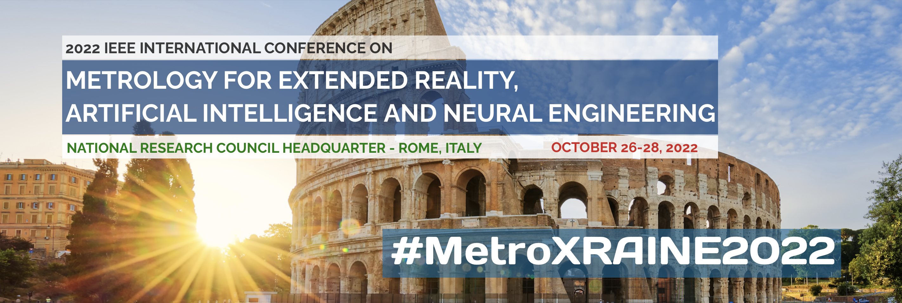

# IEEE International Conference Metrology for Extended Reality, Artificial Intelligence and Neural Engineering (MetroXRAINE, 2022)

<h3><a href="https://metroxraine.org/special-session-25" target="_blank">Special Section: From Artificial Intelligence to Extended Reality for Emergency and Disaster Management</a></h3>

   

 Organized by: 
    <a href="https://www.linkedin.com/in/silvia-liberata-ullo-67280717" target="_blank">Silvia Ullo</a>, 
    <a href="https://www.linkedin.com/in/alessandro-sebastianelli-58545915b" target="_blank">Alessandro Sebastianelli</a>, 
    <a href="https://www.linkedin.com/in/fabio-leccese-9bb6a14" target="_blank">Fabio Leccese</a>, 
    <a href="https://www.linkedin.com/in/fiora-pirri-aa02245" target="_blank">Fiora Pirri</a>        

