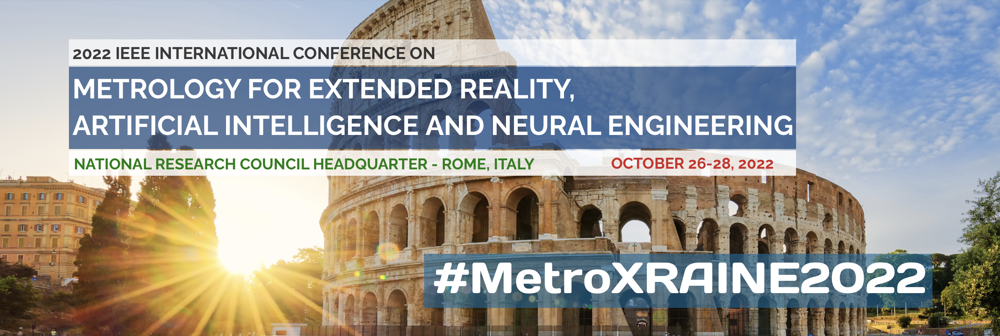

[Home](index.md)

# IEEE International Conference Metrology for Extended Reality, Artificial Intelligence and Neural Engineering (MetroXRAINE, 2022)

## [Special Section: From Artificial Intelligence to Extended Reality for Emergency and Disaster Management](https://metroxraine.org/special-session-25) 

Organized by: **[Silvia Ullo](https://www.linkedin.com/in/silvia-liberata-ullo-67280717), [Alessandro Sebastianelli](https://www.linkedin.com/in/alessandro-sebastianelli-58545915b), [Fabio Leccese](https://www.linkedin.com/in/fabio-leccese-9bb6a14) and [Fiora Pirri](https://www.linkedin.com/in/fiora-pirri-aa02245)**

    Despite the significance of studying emergency management, disaster scenes are difficult to construct in real life. To address this problem, the use of novel techniques in emergency research is essential, and the past two decades have witnessed the application of various emerging techniques in this area. Among them, Extended Reality (XR) is especially significant, as it can provide researchers with virtual emergencies without causing any real-world danger, which is essential for emergency management studies. XR helps researchers, government authorities, and rescue teams with tools for recreating the emergencies entirely through computer-generated signals of sight, so und, and touch, and overlays of sensory signals for experiences a rich juxtaposition of virtual and real worlds simultaneously, with the possibility to support the population in danger in a deeply efficient way, never experimented before.

    To support these activities the integration of other aspects is necessary. Satellite data and related advanced techniques (i.e. those based on machine learning (ML)) have a significant impact in retrieving auxiliary necessary information.

    Therefore, this special session will host contributions on XR/ML-based systems with regard to the possibility of employing satellite data for emergency and disaster management. Nevertheless, considering the innovation character of the argument treated Peculiar aspects will be the development of virtual and augmented reality environments, which can help scientists, technologists, engineers, administrators, politicians, and representatives of civil society in drawing guidelines and practices useful to manage hazard events with an increased capability.

    For instance, the European Space Agency (ESA) has a long list of projects related to public applications involving different stakeholders and people of different ages and positions:
    https://business.esa.int/projects/theme/erm
    An idea like that described above will fill an area not covered yet.

    Considering the extremely innovative nature of the special session, applications or studies concerning the individual topics and methodologies dealt with in the special session will also be taken into consideration. In fact, even if apparently they do not fall within the specific sector addressed by the Special Session, in the future, they could have repercussions also in this specific research field.

